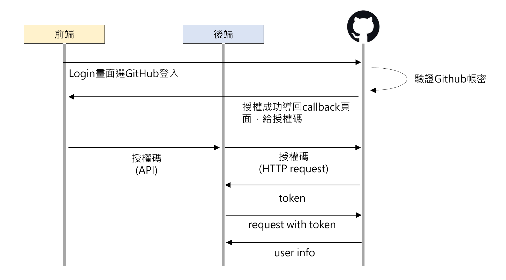

# Overview

本篇介紹如何在應用程式中整合 GitHub 作為第三方登入系統。 

 
實現前端免註冊，並按下 GitHub 登入即可完成。省去傳統註冊/驗證流程。


## 註冊 GitHub OAuth 應用

1. 登入 [GitHub](https://github.com/) 並前往 [GitHub 開發者設置](https://github.com/settings/developers)。
2. 點擊 `New OAuth App` 以建立新的 OAuth 應用。
3. 填寫應用程式相關資訊：
    - **Application name**：應用程式的名稱
    - **Homepage URL**：應用程式的主頁 URL
    - **Authorization callback URL**：當用戶成功授權後，GitHub 將重定向至此 URL，例如 `https://www.example.com/auth/github/callback`
4. 點擊 `Register application` 以完成註冊。

完成註冊保存好 Client ID 和 Client secrets key 以便於前後端使用。

**Client secrets key 只會顯示第一次明碼，如果忘記或沒保存到只能在重複以上步驟。**
 
## 前端實作 GitHub 登入

以下為簡單例子。使用 JavaScript 實作 GitHub 登入功能。


在專門處理註冊的login.vue中

```javascript
const github_login = async () => {
  const GITHUB_CONFIG = {
    clientID: 'clientID',
    redirectURI: 'Authorization callback URL',
    scope: 'user:email'
  };

  const authURL = `https://github.com/login/oauth/authorize?client_id=${GITHUB_CONFIG.clientID}&redirect_uri=${GITHUB_CONFIG.redirectURI}&scope=user:email`;
  window.location.href = authURL;
};
```
 - clientID：在 GitHub 開發者設置中獲得的應用程式 Client ID。
 - redirectURI：授權成功後，GitHub 將重定向到 URL (Authorization callback URL)。
 - scope：請求的權限範圍。 user:email，表示請求訪問用戶的電子郵件地址。
 - window.location.href：authURL 代表會轉向GitHub授權頁面。

前端點選github登入，執行這個函式之後就會自動導向github頁面了。

### 拿授權碼再送給後端驗證

github授權成功後，會導向到我們設定的 Authorization callback URL 頁面，這時我們的callback頁面打開自動執行的`onMounted`函式就會收到授權碼。


只要判定有這個授權碼`route.query.code`，我們接下來就可以再送給後端囉！

```javascript
onMounted(async () => {
  const code = route.query.code
  if (code) {
    try {
      const response = await fetch(`${apiBaseUrl}/api/v1/githublogin`, {
        method: 'POST',
        headers: {
          'Content-Type': 'application/json'
        },
        body: JSON.stringify({
          githubCode: code
        })
      });
	...
``` 


## 後端實作 GitHub 登入


### 設定 GitHub key 配置

在'application.properties'設置 clientId, clientSecret。
```application
github.client.id=xxx
github.client.secret=xxx
```

### 驗證授權碼

後端拿到前端的授權碼之後，再用授權碼去向 github 索取 token。  

先設定全域相關變數

```java
private final String accessTokenUrl = "https://github.com/login/oauth/access_token";
private final String github_user = "https://api.github.com/user";
private final String github_email = "https://api.github.com/user/emails";
@Autowired
private RestTemplate restTemplate;
```

**實作`getAccessToken`來拿token**

```java
public String getAccessToken(String code) {
	MultiValueMap<String, String> map = new LinkedMultiValueMap<>();
	map.add("client_id", clientId);
	map.add("client_secret", clientSecret);
	map.add("code", code);

	HttpHeaders headers = new HttpHeaders();
	headers.setAccept(Collections.singletonList(MediaType.APPLICATION_JSON));
	HttpEntity<MultiValueMap<String, String>> request = new HttpEntity<>(map, headers);

	ResponseEntity<String> response = restTemplate.postForEntity(accessTokenUrl, request, String.class);
	if (response.getStatusCode() == HttpStatus.OK) {
		return response.getBody();
	}
	
	return null;
}
```

### 和 Github 拿user info

有了token之後，後端就能獲取到 GitHub 用戶授權的資訊，後端就能繼續將資訊註冊到DB，實現用戶快速第三方登入。

**實作`getUserEmails`來拿user info**

```java
public List<GitHubEmail> getUserEmails(String accessToken) {
	HttpHeaders headers = new HttpHeaders();
	headers.setAccept(Collections.singletonList(MediaType.APPLICATION_JSON));
	headers.set("Authorization", "Bearer " + accessToken);
	HttpEntity<String> entity = new HttpEntity<>("", headers);
	ResponseEntity<List<GitHubEmail>> response = restTemplate.exchange(github_email, HttpMethod.GET, entity, new ParameterizedTypeReference<List<GitHubEmail>>() {});
	if (response.getStatusCode() == HttpStatus.OK) {
		return response.getBody();
	}
	// 處理錯誤
	return null;
}
```

### 完整流程

```java
@PostMapping("/githublogin")
public ResponseEntity<AuthResponse> githubLogin(@RequestBody User user) {
	String code = user.getGithubCode();
	String accessTokenResponse = getAccessToken(code);
	String accessToken = extractAccessToken(accessTokenResponse);

	GitHubUser gitHubUser = getUserInfo(accessToken);
	List<GitHubEmail> emails = getUserEmails(accessToken);
	//...到這裡驗證都完成，就算是第三方登入成功，之後就按照你的登入步驟。
}
```

 
## 總結流程
1. 前端點擊登入按鈕，跳轉頁面到 GitHub 授權頁面。
2. 用戶在授權頁面授權之後，GitHub 會將用戶重新跳轉到你設置的(Authorization callback URL)，並且附帶授權碼。
3. 前端將授權碼送到後端處理。
4. 後端利用授權碼向 Github 請求 token ，再利用 token 訪問 GitHub 帳號資訊。


簡易流程圖

